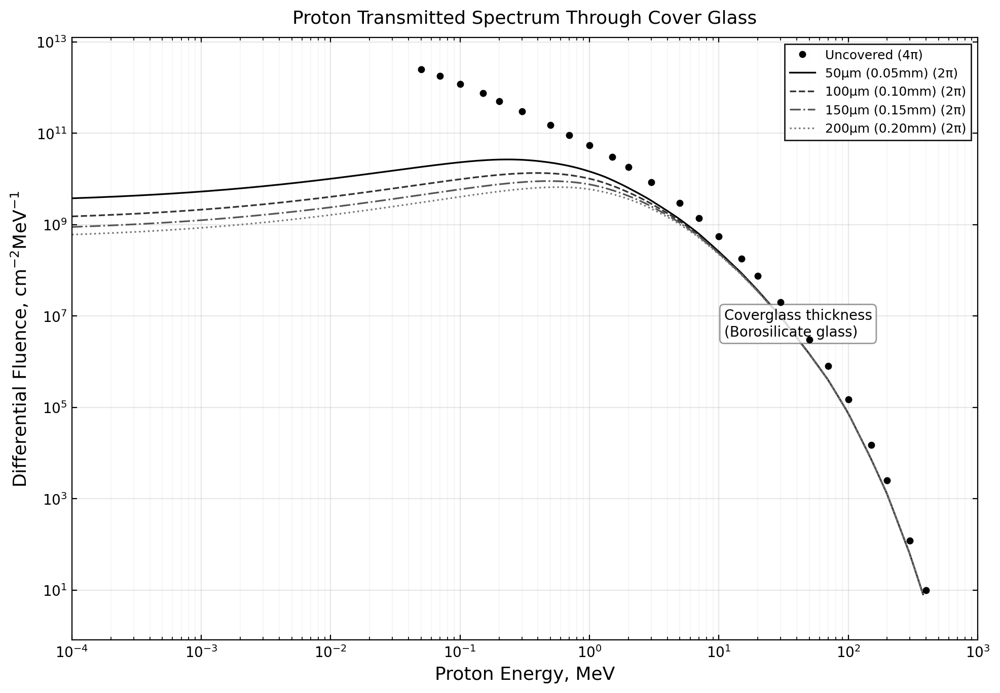
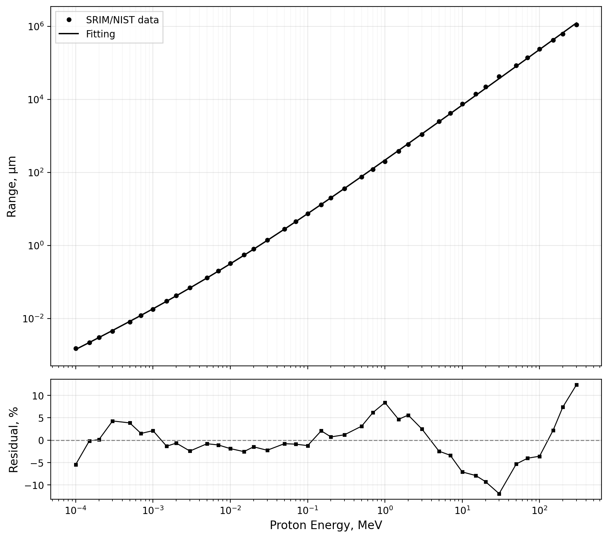
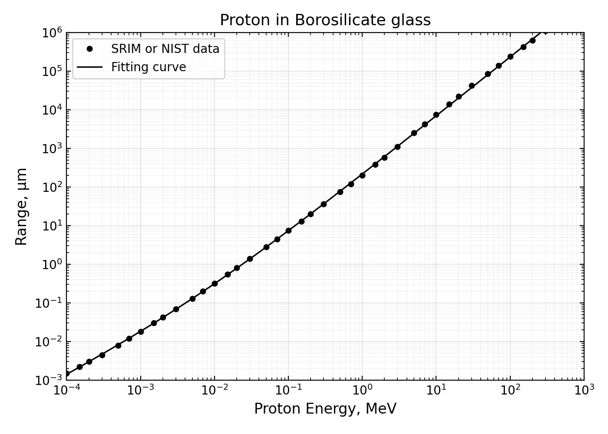
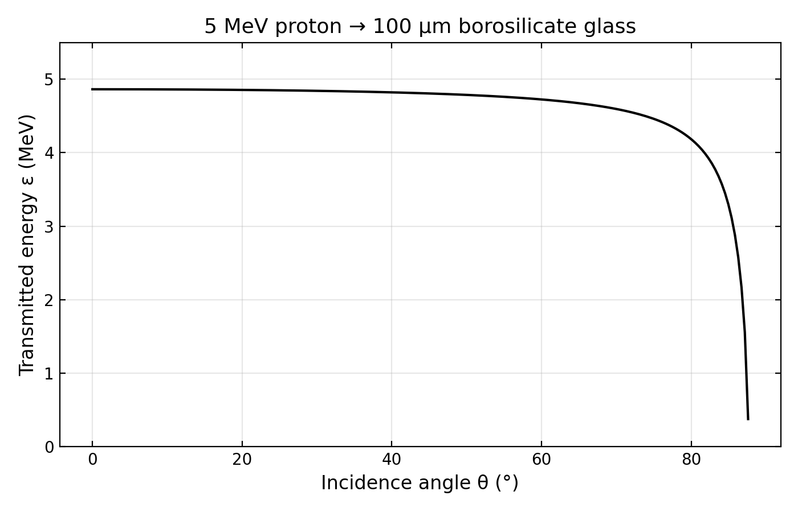
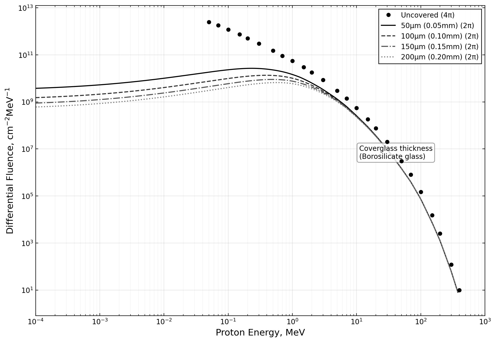

# NIEL値を用いた太陽電池劣化予測のためのカバーガラス透過後陽子線スペクトル計算

**Proton Transmitted Spectrum Calculation Through Cover Glass for Solar Cell Degradation Prediction Using NIEL**

2026年4月

> **リポジトリについて:** 本ファイルは、カバーガラス透過後の陽子線微分フルエンス計算に関する技術レポート本文である。第4章の図は、`inputs/` の CSV を入力として `src/proton_glass_transmission.py` を実行し、生成された `outputs/` 以下の PNG を参照している。環境構築と実行手順は第5章 §5.4 を参照。

---

本レポートは、宇宙空間における太陽電池の放射線劣化予測に用いられる Displacement Damage Dose（D_d）法において必要となる、カバーガラス透過後の陽子線微分フルエンスの算出手法をまとめたものである。ホウケイ酸ガラス中の陽子線飛程のフィッティング、等方入射放射線の遮蔽材透過後スペクトルの計算式の導出と数値計算手順、および LEO 軌道環境を入力とした計算結果について報告する。

---

## 1. はじめに

### 1.1 背景と目的

宇宙空間に配置される太陽電池は、捕捉放射線帯の陽子線や電子線、および太陽フレア粒子線などの放射線環境に曝される。これらの放射線は半導体材料内にはじき出し損傷（Displacement Damage）を引き起こし、太陽電池の出力特性を経年劣化させる。衛星の電力系設計においては、ミッション期間中の太陽電池出力の劣化を事前に予測し、End-of-Life（EOL）での所要電力を確保するための設計余裕を確保することが不可欠である。

太陽電池の放射線劣化予測手法として、US Naval Research Laboratory（NRL）により開発された Displacement Damage Dose（D_d）法がある。この手法では、非イオン化エネルギー損失（Non-Ionizing Energy Loss: NIEL）値を用いて、異なるエネルギーおよび異なる粒子種の放射線による損傷を統一的な線量として扱うことができる。D_d 法は、従来の JPL 等価フルエンス法と比較して、少ない照射試験データから劣化予測が可能であるという利点を持つ。

D_d 法を用いた劣化予測では、軌道上の放射線環境データ（微分フルエンス）と対象材料の NIEL 値を掛け合わせて損傷線量を算出する。しかし、実際の太陽電池パネルではカバーガラス（遮蔽材）が太陽電池の前面に配置されるため、軌道上の放射線環境をそのまま用いることはできない。カバーガラスを透過する際に放射線は減速し、そのエネルギースペクトルが大きく変化する。特に低エネルギー陽子線はカバーガラス中で停止するが、高エネルギー陽子線が減速して低エネルギー側に蓄積するため、透過後のスペクトル形状は入射スペクトルとは大きく異なるものとなる。

本レポートでは、ホウケイ酸ガラスを遮蔽材とした場合の陽子線微分フルエンスの算出方法について、理論的背景から数値計算の実装までを体系的に整理する。

### 1.2 レポートの構成

本レポートは以下の構成からなる。第2章では、NIEL 値と D_d 法の理論的背景、およびカバーガラス透過の物理を述べる。第3章では、透過後スペクトルの計算式を導出し、数値計算の手順を説明する。第4章で計算結果を示し、第5章で作成した Python コードの概要を示す。第6章で今後の課題をまとめる。

---

## 2. 理論的背景

### 2.1 NIEL値の概要

NIEL 値は、入射粒子がターゲット材料の格子原子にはじき出し損傷を与える際のエネルギー損失率を表す物理量であり、単位は MeV·cm²/g である。NIEL 値の計算には、はじき出し断面積、はじき出しエネルギー、および Lindhard partition factor（はじき出し原子が非イオン化過程で失うエネルギーの比率）が用いられる。

陽子線の場合、低エネルギー領域では Rutherford 散乱の微分はじき出し断面積が基本となるが、実際には ZBL（Ziegler, Biersack, and Littmark）ユニバーサルポテンシャルによる遮蔽クーロン相互作用を考慮した計算が行われる。電子線の場合は、MeV 領域では相対論的な取り扱いが必要となり、McKinley-Feshbach の式が用いられる。

NIEL 値は既に主要な半導体材料（Si、GaAs、Ge、InP 等）について文献で報告されており、化合物に対しては Bragg の法則に従って構成元素の NIEL 値から計算できる。例えば、GaAs の場合は Ga と As の NIEL 値を原子量で重みづけして合成する。

### 2.2 Displacement Damage Dose (D_d)

D_d 法では、放射線が太陽電池に与える損傷を、粒子種やエネルギーによらない統一的な線量として定義する。陽子線に対する Displacement Damage Dose D_p は次式で定義される:

$$
D_p = \Phi_p(E) \cdot S_p(E) \quad [\text{MeV/g}]
$$

ここで、Φ_p(E) はエネルギー E の陽子線フルエンス（cm⁻²）、S_p(E) は対応する NIEL 値（MeV·cm²/g）である。スペクトルを持つ陽子線に対しては、微分フルエンスと NIEL 値の積をエネルギーについて積分する:

$$
D_p = \int \frac{d\Phi_p(E)}{dE} \cdot S_p(E) \, dE
$$

陽子線の場合、損傷係数と NIEL 値の間に線形関係が成立するため、劣化曲線は D_d で一本にまとめることができる。これにより、一つの照射エネルギーの実験データから、任意のエネルギースペクトルに対する劣化を予測できる。

一方、電子線の場合は損傷係数と NIEL 値の間に非線形関係（n 乗の関係）があるため、実効等価 1MeV 電子線量 D_e,eff を用いる。GaAs 太陽電池の場合、補正係数 n = 1.7 が用いられる。この非線形性のため、電子線の劣化予測には少なくとも2つの異なるエネルギーでの照射試験データが必要となる。

全損傷線量 D_d_total は、陽子線と電子線の寄与を次式で合算する:

$$
D_{d\_total} = D_p + \frac{D_{e,eff}(1.0)}{R_{ep}}
$$

ここで R_ep = D_ex / D_px は、劣化曲線のフィッティングパラメータから求められる電子線・陽子線の等価係数である。この全損傷線量から、劣化曲線（半実験式）を用いて太陽電池特性（P_max、I_sc、V_oc）の保存率を求めることができる。

### 2.3 遮蔽材中の陽子線飛程

NIEL を用いた劣化予測において、カバーガラス透過後の放射線スペクトルを求めるためには、遮蔽材中における放射線の飛程（Range）を知る必要がある。陽子線の飛程は SRIM や NIST のデータベースから取得できるが、スペクトル計算を連続的に行うために、飛程のエネルギー依存性を解析的な関数でフィッティングする。

エネルギー E (MeV) の陽子線のホウケイ酸ガラス中における飛程 R(E) (μm) は、次のべき乗の和の形でフィッティングできる:

$$
R(E) = A \cdot E^a + B \cdot E^b \quad [\mu\text{m}] \quad \cdots (1)
$$

SRIM/NIST のデータに対して非線形最小二乗法によりパラメータを決定した結果を Table 1 に示す。このフィッティングは 10⁻⁴ から 300 MeV の広いエネルギー範囲にわたって平均残差3.7%で良好な近似を与える。

**Table 1: ホウケイ酸ガラス中の陽子線飛程フィッティングパラメータ**

| Parameter | Value | Description |
|-----------|-------|-------------|
| A | 202.0955 | Coefficient 1 |
| a | 1.5279 | Exponent 1 (high-E dominant) |
| B | 14.7058 | Coefficient 2 |
| b | 1.0166 | Exponent 2 (low-E dominant) |

第1項（A·Eᵃ、a=1.53）は高エネルギー領域を支配し、第2項（B·Eᵇ、b=1.02）は低エネルギー領域で重要となる。b が 1 に近いことは、低エネルギーでの飛程がエネルギーにほぼ比例することを意味する。一方、高エネルギーでは飛程がエネルギーの約1.5乗に比例して急速に増加する。このエネルギー依存性の違いが、透過後スペクトルの低エネルギー側の特徴的な形状に直接反映される。

### 2.4 カバーガラス透過後のエネルギー

入射エネルギー E の陽子線が厚さ t (μm) の遮蔽材に角度 θ で入射した場合を考える。陽子線は遮蔽材中を直線的に進み、通過距離 t/cosθ の間にエネルギーを失う。遮蔽材透過後の残留エネルギー ε は、残りの飛程から求められる:

$$
R(\varepsilon) = R(E) - \frac{t}{\cos\theta} \quad \cdots (2)
$$

R(ε) > 0 の場合に陽子線は透過し、残留エネルギー ε で太陽電池に到達する。R(ε) が 0 以下となる場合は、陽子線は遮蔽材内部で全エネルギーを失い停止するため太陽電池に到達しない。

同じ入射エネルギー E の陽子線であっても、入射角度 θ によって実効パス長 t/cosθ が異なるため、透過後エネルギー ε は角度に依存する。垂直入射（θ = 0）ではパス長が最小（= t）でエネルギー損失も最小となる。一方、角度が大きくなるほどパス長が増加し、残留エネルギーは低下する。ある臨界角 θ_max 以上では陽子線はガラス内で停止する。

各ガラス厚に対して、垂直入射時に透過できる最小エネルギー（R(E_min) = t を満たす E_min）を Table 2 に示す。斜め入射ではさらに高いエネルギーが必要となる。

**Table 2: 各ガラス厚における垂直入射時の最小透過エネルギー**

| Glass thickness | t [μm] | E_min (θ=0°) [MeV] | R(E_min) [μm] |
|-----------------|--------|---------------------|----------------|
| 0.05 mm | 50 | 0.372 | 50.0 |
| 0.10 mm | 100 | 0.595 | 100.0 |
| 0.15 mm | 150 | 0.781 | 150.0 |
| 0.20 mm | 200 | 0.947 | 200.0 |

例として、5 MeV 陽子線が 100 μm のホウケイ酸ガラスを透過する場合を考える。5 MeV 陽子線の飛程は約 2439 μm であり、100 μm のガラス厚に対して十分に大きい（ガラス厚比約4%）。垂直入射ではエネルギー損失はわずか 0.14 MeV（約3%）にとどまるが、θ が約 87.6°（臨界角）付近ではパス長が飛程に等しくなり、透過後エネルギーがゼロに近づく。

宇宙空間では放射線は全方向（4π空間）から等方的に飛来する。太陽電池のカバーガラス表面には様々な角度から陽子線が入射するため、透過後のエネルギースペクトルを正確に求めるには、全入射角度（0 から π/2）にわたる角度積分が必要となる。

---

## 3. 透過後スペクトルの計算方法

### 3.1 基本式の導出

入射スペクトルを g(E)（4π空間微分フルエンス、単位: cm⁻² MeV⁻¹）とし、カバーガラス透過後のスペクトルを f(ε)（2π空間微分フルエンス）とする。4π空間とは全球（全方向）からの放射線量であり、SPENVIS や SEES 等の宇宙環境モデルの標準出力形式である。2π空間とは裏面を半無限厚の遮蔽とした場合の前面半球からの放射線量を意味する。

#### 3.1.1 単一角度でのスペクトル変換

固定された入射角度 θ で入射する陽子線について考える。入射エネルギー E の粒子が遮蔽材を透過してエネルギー ε で出てくるとき、粒子数の保存から次の関係が成り立つ:

$$
f(\varepsilon) \, d\varepsilon = g(E) \, dE
$$

よって:

$$
f(\varepsilon) = g(E) \cdot \left|\frac{dE}{d\varepsilon}\right| \quad \cdots (3)
$$

ここで dE/dε はスペクトル変換のヤコビアン（Jacobian）であり、入射エネルギーの変化と透過後エネルギーの変化の比率を表す。

#### 3.1.2 ヤコビアン dE/dε の導出

式(2) R(ε) = R(E) - t/cosθ において、t と θ は定数である。E は ε の関数 E(ε) であるから、両辺を ε で微分すると:

$$
R'(\varepsilon) = R'(E) \cdot \frac{dE}{d\varepsilon}
$$

したがってヤコビアンは:

$$
\frac{dE}{d\varepsilon} = \frac{R'(\varepsilon)}{R'(E)} \quad \cdots (4)
$$

ここで R'(E) = dR/dE = aAE^(a-1) + bBE^(b-1) は飛程の微分である。E > ε であり R'(E) は E の単調増加関数であるため、常に R'(E) > R'(ε) が成り立ち、dE/dε < 1 となる。

この結果の物理的意味は以下の通りである。入射エネルギーが dE だけ増加すると、透過後エネルギーは dε = dE · R'(E)/R'(ε) > dE だけ増加する。すなわち透過後のエネルギー空間は「引き伸ばされ」、スペクトルは入射時に比べて「圧縮」される。具体的には f(ε) = g(E) · R'(ε)/R'(E) < g(E) となり、透過後の微分フルエンスは対応する入射エネルギーでの値よりも常に小さい。

低エネルギー（ε が 0 に近づく極限）では R'(ε) が小さくなるため dE/dε は非常に小さくなり、透過後スペクトルは入射スペクトルに比べて大幅に圧縮される。一方、高エネルギー（E と ε がほぼ等しい場合）では R'(ε) = R'(E) であるため dE/dε = 1 となり、ガラスの影響は無視できる。

#### 3.1.3 角度積分と 4π から 2π への変換

全方向からの等方入射を考慮するため、入射角度 θ にわたって積分する。4π空間の等方フルエンス g(E) に対して、単位立体角あたりのフルエンスは g(E)/(4π) である。前面半球（2π空間）からの寄与を方位角 φ と天頂角 θ で積分すると:

$$
f(\varepsilon) = \int_0^{2\pi} d\varphi \int_0^{\pi/2} \frac{g[E(\theta)]}{4\pi} \cdot \frac{R'(\varepsilon)}{R'(E)} \cdot \sin\theta \, d\theta
$$

方位角の積分は 2π を与えるので、最終的に:

$$
f(\varepsilon) = \frac{1}{2} \int_0^{\pi/2} g[E(\theta)] \cdot \frac{R'(\varepsilon)}{R'(E(\theta))} \cdot \sin\theta \, d\theta \quad \cdots (5)
$$

係数 1/2 = 2π/(4π) は 4π空間のフルエンスから 2π空間（前面半球）への変換係数である。等方放射線では全球の放射線の半分が前面半球から到来するためこの係数が必要となる。なお、RDC 法とは異なりこの式には cosθ の項がないため、等方入射の微分フルエンスが計算される。

高エネルギーの極限（E と ε がほぼ等しく、ガラスの影響が無視できる場合）では、R'(ε) = R'(E)、dE/dε = 1 となり:

$$
f(\varepsilon) = \frac{1}{2} \cdot g(\varepsilon) \cdot \int_0^{\pi/2} \sin\theta \, d\theta = \frac{g(\varepsilon)}{2}
$$

これは 4π フルエンスの半分であり、2π空間として物理的に正しい極限値である。

### 3.2 数値計算の手順

式(5)を数値的に計算するための手順を以下に示す。

**(1) 透過後エネルギーグリッドの設定:** 透過後エネルギー ε_j（j = 1, ..., N_E）を対数等間隔で設定する。典型的には 10⁻⁴ から 10³ MeV の範囲に 200 点を配置する。対数等間隔とすることで、低エネルギー側と高エネルギー側の双方をバランスよく分解できる。

**(2) 角度グリッドの設定:** 入射角度 θ_k（k = 1, ..., N_θ）を 0 から π/2 の範囲で等間隔に設定する。典型的には 200 点を用いる。θ = π/2（水平入射）ではパス長が発散するため除外する。

**(3) 入射エネルギーの逆算:** 各組み合わせ（ε_j, θ_k）に対して、R(E) = R(ε_j) + t/cosθ_k を満たす入射エネルギー E を数値的に求める。飛程関数 R(E) は単調増加であるため、Brent 法（二分法の改良版）により効率的かつ確実に逆関数を求めることができる。

**(4) 微分フルエンスの補間:** 求めた入射エネルギー E に対する環境データの微分フルエンス g(E) を対数線形補間で取得する。環境データのエネルギー範囲外の場合は寄与をゼロとする。

**(5) ヤコビアンの計算:** R'(ε_j) と R'(E) を求め、その比 dE/dε = R'(ε_j) / R'(E) を計算する。

**(6) 角度加重和と半球変換:** 全角度にわたって g(E) · (dE/dε) · sinθ_k · Δθ を加算し、最後に係数 1/2 を乗じて f(ε_j) を得る。

この計算を全ての ε_j について繰り返すことで透過後微分フルエンススペクトル f(ε) が得られる。計算量は O(N_E × N_θ) であり、N_E = N_θ = 200 の場合、1ガラス厚あたり約2秒の計算時間である。

---

## 4. 計算結果

上述の手法により、LEO 600km 軌道（軌道傾斜角 98.6°、5年間）の捕捉陽子線環境に対するカバーガラス透過後の微分フルエンスを計算した。遮蔽材はホウケイ酸ガラス、厚さは 50、100、150、200 μm の4種類である。

### 4.1 スペクトルの特徴

**高エネルギー領域（> 10 MeV）:** この領域では陽子線の飛程がガラス厚に比べて十分に長い（例: 10 MeV 陽子線の飛程は約 7000 μm であり、200 μm に対して十分大きい）ため、ガラスによるエネルギー損失は無視できる。全ガラス厚での透過後スペクトルが遮蔽なし（4π）の約 1/2 に収束する。この 1/2 は 4π から 2π への変換の幾何学的因子であり、式(5)の導出と整合している。

**中エネルギー領域（0.1 から 10 MeV）:** カバーガラスの影響が顕著に現れる遷移領域である。ガラスを透過する際のエネルギー損失が無視できなくなり、スペクトルは遮蔽なしの値から徐々に低下する。厚いガラスほどこの遷移が高エネルギー側から始まる。

**低エネルギー領域（< 0.1 MeV）:** この領域のエネルギーを持つ陽子線は飛程がガラス厚より短く直接透過できないが、より高いエネルギーで入射した陽子線がガラス中で減速し、低いエネルギーで透過してくる。この効果により、飛程のエネルギー依存性 R が E の約1.53乗に比例することを反映した特徴的なバンプ（0.3 から 1 MeV 付近の山）とプラトー構造が形成される。バンプのピーク位置は、ガラスをちょうど透過できる最小エネルギー付近に対応する。このスペクトル形状は文献[5]の図10と良好に一致しており、計算手法の妥当性を確認できる。

### 4.2 ガラス厚の効果

Table 3 に各ガラス厚における計算結果の要約を示す。ガラスを厚くすることで、低エネルギー陽子線がガラス内で停止して除去される効果と、高エネルギー陽子線がより大きくエネルギーを失う効果が増加し、積分フルエンスが減少する。50 μm から 200 μm に厚さを4倍にすることで、積分フルエンスは約 4.4×10¹⁰ から 2.0×10¹⁰ へと約半分に低減される。

**Table 3: 各ガラス厚における最小透過エネルギー、積分フルエンスおよび低減率**

| Glass thickness | E_min (θ=0°) | Integrated fluence (2π) | Reduction |
|-----------------|-------------|-------------------------|-----------|
| 50 μm (0.05 mm) | 0.372 MeV | 4.41 × 10¹⁰ cm⁻² | 1.00 (ref.) |
| 100 μm (0.10 mm) | 0.595 MeV | 3.07 × 10¹⁰ cm⁻² | 0.70 |
| 150 μm (0.15 mm) | 0.781 MeV | 2.42 × 10¹⁰ cm⁻² | 0.55 |
| 200 μm (0.20 mm) | 0.947 MeV | 2.02 × 10¹⁰ cm⁻² | 0.46 |

ただし、劣化予測においてはフルエンスの絶対量だけでなくエネルギー分布も重要である。低エネルギー陽子線の NIEL 値は高エネルギーよりも大きいため、ガラス透過で低エネルギー側にシフトした陽子線の損傷寄与は相対的に大きくなる可能性がある。最終的な D_d の計算では、透過後スペクトルと NIEL 値の積のエネルギー積分が必要であり、フルエンス低減と低エネルギーシフトの両方の効果を考慮しなければならない。

### 4.3 再現用図（本リポジトリで生成）

`inputs/` の環境CSVと飛程参照CSVを用いて `src/proton_glass_transmission.py` を実行すると、`outputs/` に次の図が得られる。本文の議論（飛程フィットの妥当性、透過後スペクトル形状）の確認に用いる。





### 4.4 レポートPDFに埋め込まれていた図（抽出画像）

レポート用PDF（全14ページ）のうち、**ページ4・7・11**にラスタ画像として埋め込まれていた図を、`pdfimages` で取り出し、`outputs/` に保存した。本文の理論説明・スペクトル議論と併せて参照できる（ベクター部は含まず、埋め込みビットマップのみ）。

**ページ4付近の埋め込み図**



**ページ7付近の埋め込み図**



**ページ11付近の埋め込み図**



再抽出する場合の例（リポジトリルートで、`outputs/` に書き出す）:

```bash
pdfimages -png <元の14ページPDF> outputs/report_pdf_embed_tmp
```

接頭辞に続く連番のうち、RGB 本体（通常は `-000.png`, `-002.png`, `-004.png` など大きいファイル）を上記ファイル名にリネームして使う。

---

## 5. 作成した Python コード

本検討で作成した計算コード `src/proton_glass_transmission.py` は、上述の理論に基づいてカバーガラス透過後の陽子線微分フルエンスを計算するスタンドアロンの Python スクリプトである（リポジトリでは `src/` 配下に配置）。

### 5.1 入力と出力

**入力（2ファイル）:**

1. **環境スペクトル用 CSV**（A列: Proton Energy [MeV]、B列: Differential Fluence [cm⁻² MeV⁻¹]）。4π空間の微分フルエンスであり、SPENVIS や SEES 等の出力データをそのまま使用できる。ヘッダ行は自動スキップされる。

2. **飛程参照用 CSV**（A列: Energy [MeV]、B列: Range_SRIM_NIST [μm]）。式(1)のフィット曲線と SRIM/NIST 参照飛程との比較（残差含む）を出力するために用いる。3列目以降があっても読み込み時は未使用でよい。

**出力（`outputs/` ディレクトリ）:**

- `transmitted_fluence.csv` — 各ガラス厚での透過後微分フルエンス（エネルギーグリッド上）
- `transmitted_fluence.png` — スペクトル比較プロット（文献[5]の図10相当の用途）
- `fig3_range_fit.csv` — 参照飛程、フィット飛程、残差（%）
- `fig3_range_fit.png` — 飛程フィットと残差の図
- `report_pdf_embed_p04.png`, `report_pdf_embed_p07.png`, `report_pdf_embed_p11.png` — 第4章 §4.4 のとおり、レポートPDFに埋め込まれていた図を `pdfimages` で抽出したもの

### 5.2 設定パラメータ

スクリプト冒頭のパラメータを変更することで計算条件をカスタマイズできる:

**Table 4: proton_glass_transmission.py の設定パラメータ**

| Parameter | Default | Description |
|-----------|---------|-------------|
| GLASS_THICKNESSES_MM | [0.05, 0.1, 0.15, 0.2] | Glass thickness [mm] |
| N_ENERGY_POINTS | 200 | Energy grid points |
| N_THETA | 200 | Angle grid points |
| RANGE_A, a, B, b | Borosilicate glass | Range fitting params |

### 5.3 使用方法と拡張性

リポジトリルートで、環境CSVと飛程参照CSVの**2引数**を指定して実行する。実行前に `outputs/` が無ければ自動作成される。

```bash
python src/proton_glass_transmission.py \
  inputs/proton_environment_LEO600km.csv \
  inputs/range_borosilicate_glass.csv
```

飛程フィッティングパラメータ（RANGE_A, a, B, b）を変更することで、ホウケイ酸ガラス以外の遮蔽材（CMG 石英ガラス、サファイアガラス等）にも対応可能である。ガラス厚のリストも任意に変更できる。計算時間は N_E = N_θ = 200 の場合、1ガラス厚あたり数秒程度である。

### 5.4 実装詳細（`src/proton_glass_transmission.py`）

本節は第3章 §3.2 の数値手順とソースコードの対応を明示する。

#### 5.4.1 環境構築（Linux + `uv`）

```bash
cd /home/shirokawakita/Desktop/cursor/space_enviromental_analysis
uv venv
source .venv/bin/activate
uv pip install -r requirements.txt
```

依存パッケージは `requirements.txt` に記載（`numpy`, `scipy`, `matplotlib`）。`matplotlib` は非対話用バックエンド `Agg` を使用する。

#### 5.4.2 処理フロー概要

1. 引数として環境CSV・飛程参照CSVの2パスを受け取り、存在確認後に `outputs/` を作成する。
2. `read_environment_csv` で \(g(E)\) の離散データを読み、`create_fluence_interpolator` で \(\log_{10} E\)–\(\log_{10} F\) の線形補間関数を構築する（範囲外は寄与0）。
3. `read_range_reference_csv` で参照飛程を読み、式(1)の \(R(E)\) との残差を `fig3_range_fit.csv` / `fig3_range_fit.png` に出力する。
4. 透過後エネルギー \(\varepsilon_j\) を `numpy.logspace` で生成し、各ガラス厚 \(t\) について `compute_transmitted_spectrum` で式(5)の角度和を評価する。
5. `write_output_csv` / `create_plot` で `transmitted_fluence.csv` / `transmitted_fluence.png` を出力する。

#### 5.4.3 主要関数と式の対応

| 関数 | 対応する式・役割 |
|------|------------------|
| `range_func` | 式(1) \(R(E)\) |
| `dR_dE` | \(R'(E)\)、式(4)(5)のヤコビアン |
| `find_energy_from_range` | 式(2)を満たす \(E\) の逆算（`scipy.optimize.brentq`） |
| `create_fluence_interpolator` | §3.2 手順(4) の \(g(E)\) 補間 |
| `compute_transmitted_spectrum` | 式(2)(4)(5)の二重ループ本体 |
| `write_fig3_csv`, `create_fig3_plot` | 式(1)と参照データの比較図 |
| `write_output_csv`, `create_plot` | 式(5)の結果の表・図 |
| `main` | 上記の統合制御 |

#### 5.4.4 数値上の注意

- \(\theta = \pi/2\) 付近では \(t/\cos\theta\) が発散するため、積分上限を \(\pi/2\) よりわずかに手前に取る。
- `E_inc <= ε` や補間範囲外の \(g(E)\) は寄与を加えない。
- 積分フルエンスの確認には `numpy.trapezoid` を用いる（実行ログにも表示）。

---

## 6. 今後の課題

本検討で確立した陽子線の透過スペクトル計算手法をベースとして、以下の拡張が今後の課題となる。

### 6.1 電子線への拡張

電子線の飛程には式(1)のような解析的フィッティング式が与えられていないため、NIST のデータベース（ESTAR）から飛程データを取得し、数値テーブルの補間により計算する必要がある。ヤコビアンの計算にも飛程の数値微分が必要となる。電子線はこのエネルギー領域では透過力が強いため、カバーガラスによるスペクトル変形は陽子線ほど顕著ではないと予想される。

### 6.2 NIEL値との畳み込みと D_d 算出

透過後スペクトルが得られれば、各材料の NIEL 値 S(ε) を掛けてエネルギー積分することで、陽子線による D_p を算出できる。電子線の寄与と合算して全損傷線量 D_d_total を求め、劣化曲線のフィッティングパラメータから太陽電池特性の保存率を予測する一連のフローの実装が次のステップとなる。

### 6.3 多接合セルへの対応

InGaP/GaAs/Ge 等の3接合セルでは、低エネルギー陽子線がトップ層またはミドル層で停止する場合があり、セル構造に依存した劣化特性が現れる。各サブセルの厚さと材料を考慮した層ごとの到達エネルギー分布計算が必要である。

### 6.4 新型太陽電池への適用

CIGS 薄膜太陽電池やペロブスカイト太陽電池など次世代宇宙用太陽電池の放射線耐性評価に本手法を適用することが期待される。SCAPS-1D シミュレーション等による NIEL 値の取得と組み合わせることで、rollover 現象やアニーリング特性も含めた総合的な耐放射線性評価が可能となる。

### 6.5 環境データの精緻化

本検討では入力環境データとしてグラフから読み取った近似値を用いた。SPENVIS からの正確な軌道環境データの入力による定量的な検証、および太陽フレア粒子線等の寄与を含めた総合的な評価への拡張が今後の課題である。

---

## 参考文献

[1] G. P. Summers, E. A. Burke, P. Shapiro, S. R. Messenger, and R. J. Walters, "Damage Correlation in Semiconductors Exposed to Gamma, Electron and Proton Radiations", IEEE Trans. Nucl. Sci., 40(6), 1372-1379, 1993.

[2] S. R. Messenger, E. A. Burke, M. A. Xapsos, G. P. Summers, R. J. Walters, I. Jun, and T. Jordan, "NIEL for Heavy Ions: An Analytical Approach", IEEE Trans. Nucl. Sci., 50(6), 1919-1923, 2003.

[3] I. Jun, M. A. Xapsos, S. R. Messenger, E. A. Burke, R. J. Walters, G. P. Summers, and T. Jordan, "Proton Nonionizing Energy Loss (NIEL) for Device Applications", IEEE Trans. Nucl. Sci., 50(6), 1924-1928, 2003.

[4] S. R. Messenger, G. P. Summers, E. A. Burke, R. J. Walters, and M. A. Xapsos, "Modeling Solar Cell Degradation in Space: A Comparison of the NRL Displacement Damage Dose and the JPL Equivalent Fluence Approaches", Prog. Photovoltaics, 9, 103-121, 2001.

[5] G. P. Summers, S. R. Messenger, E. A. Burke, M. A. Xapsos, and R. J. Walters, "Contribution of Low-energy Protons to the Degradation of Shielded GaAs Solar Cells in Space", Prog. Photovoltaics, 5, 407-413, 1997.

[6] S. R. Messenger, M. A. Xapsos, E. A. Burke, R. J. Walters, and G. P. Summers, "Proton Displacement Damage and Ionizing Dose for Shielded Device in Space", IEEE Trans. Nucl. Sci., 44(6), 2169-2173, 1997.
